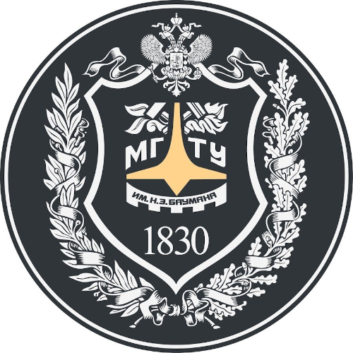

# 01-sem-py-algo

1 Semester Python and Algorithms and Data Structures Course

## Goals

The main goal of this course is to show first-year FS12 students how to write clean, easy-to-read and easy-to-support code with complete understanding of its algorithmic complexity. During this course students will learn following topics:

- basics of Python;
- concepts of asymptotic complexity, algorithms and data structures;
- numerous algorithmic areas: sorting algorithms, hashes & hash-maps, trees;
- basics of Object-Oriented Programming (OOP);
- SQL essentials;
- basics of asynchronous and parallel programming;
- usage of GIT & Github;
- small future career tips.

## Requirements

To complete course students have to **pass 3 tests** and do some **coding hometasks**.

It is highly recommended to have **your own computer** (laptop is better) to complete this course, because you will have to write some code as a homework.
It is worth to use **Unix-like Operating System** (Linux, BSD, MacOS) during this course, because some actions are much easier with it. Window Subsystem for Linux is Okay, but we do not really recommend it.

**Teamwork is appreciated** during this course, but **not cheating**.

## Plan

Course consists of 34 standard classes (one class - 1.5 hour): 2 classes per week. Most time you will have 2 consecutive classes in one day each week.

Each week includes two video lectures in russian language and two presentations, worth-to-read links and homework tasks.

#### 1 Week. Python Basics I.
Class 1:
- course description & plan;
- lecturers presentation;
- Python installation and "Hello-World" program;
- Github & README format;
- Linkedin.

Class 2:
- variables;
- if-elif-else;
- for & while;
- functions;
- recursion.

#### 2 Week. Python Basics II.
Class 1:
- lists & tuples;
- dicts & sets;
- container's iterators;
- type-hints.

Class 2:
- lambda, map & filter;
- modules, packages & main;
- I/O & files;

#### 3 Week. Object-Oriented Programming.

Class 1:
- objects and their fields and methods;
- private fields;
- inheritance;
- polymorphism.

Class 2:
- small OOP examples.

#### 4 Week. Test and Homework check.

#### 5 Week. Asymptotic Complexity.

Class 1:
- asymptotic complexity & O-notation;
- complexity of loops, inner loops and recursion;
- linear & binary search;
- heap.

Class 2:
- bubble sort and insertion sort;
- standard Python sorting methods.

#### 6 Week. Sorting Algorithms.

Class 1:
- best asymptotic complexity for sort with comparator;
- quick-sort;
- heap-sort;
- merge-sort.

Class 2:
- K-th statistic;
- BPFRT-algorithm;
- sorting algorithms with linear time complexity.

#### 7 Week. String Algorithms.

Class 1:
- strings in Python & other programming languages;
- mutable & immutable strings;
- naive substring search.

Class 2:
- Knut-Morris-Pratt algorithm;
- Boyer-Murr algorithm.

#### 8 Week. List, Stack & Queue.

Class 1:
- single-linked list;
- double-linked list;
- skip-list;
- list sorting.

Class 2:
- stack;
- queue;
- priority queue.

#### 9 Week. Test and Homework check.

#### 10 Week. Binary Trees and AVL Trees.

Class 1:
- what is tree in programming?
- binary trees.

Class 2:
- AVL trees.

#### 11 Week. Trees in Databases.

Class 1:
- B-tree.

Class 2:
- B+tree;
- LSM-tree.

#### 12 Week. Hash-Functions & Hash-Maps.

Class 1:
- Python dict & set implementation;
- examples of hash-functions;

Class 2:
- naive hash-map;
- opened-key hash-map;
- closed-key hash-map.

#### 13 Week. Join algorithms & SQL Basics I.

Class 1:
- tables, rows and collumns;
- primary keys, foreign keys and indexes;
- join algorithms.

Class 2:
- nested-loop join;
- hash join;
- merge join;
- filtering;

#### 14 Week. SQL Basics II.

Class 1:
- CRUD queries.

Class 2:
- sub-queries and CTEs.

#### 15 Week. Test and Homework check.

#### 16 Week. Bonus: Parallel and Asynchronous programming.

Class 1:
- parallel counters;
- parallel merge sort;
- mutexes & atomic variables.

Class 2:
- parallel programming examples.

#### 17 Week. Bonus: Network Programming and IO-bound vs CPU-bound tasks.

Class 1:
- TCP & UDP, HTTP;
- sending many-many requests in one second.

## Authors
- asynchronous programming essentials.
- IO-bound vs CPU-bound tasks.

#### Lecturer
[**Mikhail Masyagin**](https://github.com/masyagin1998)

- Senior Software Engineer at [Anecdote](https://anecdoteai.com);
- Software Engineer at [STC Atlas](https://stcnet.ru);
- Assistant Lecturer at [BMSTU](https://bmstu.ru).

#### Teacher
[**Daniil Devyatkin**](https://github.com/d3vyatk4ru)

- Data Scientist at [VK](https://vk.company/ru);
- Assistant Lecturer at [BMSTU](https://bmstu.ru).

## Thanks to
Many thanks to **Vladimir Goryainov** for being my scientific advisor and for **Vladimir Pankratov** and **Elena Tverskaya** - people without who this course would be impossible.
